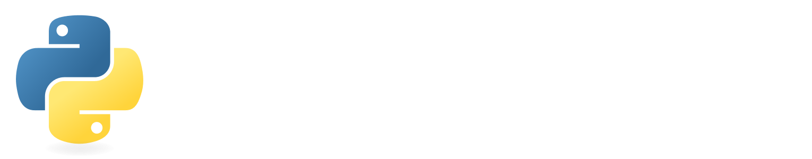

 

Python, the famous programming language that has gone viral thanks to its simplicity and versatility, is at the heart of this library. It brings together a wide range of tools for everyday use, from creating interactive games to automating tasks and improving productivity. 

# Table of contents

- [Files](/Files/README.md)
  - [Duplicate local file checkup](/Files/DuplicateFileCheckup.py)
  - [Navidrome SFTP transfert](/Files/NavidromeSFTPTransfert.py)
  - [Translator](/Files/Translator.py)
- [Games](/Games/README.md)
  - [Guess Number](/Games/GuessNumber.py)
  - [Rock Paper Scissors](/Games/RockPaperScissors.py)
- [Hacking](/Hacking/README.md)
  - [Interactive NMAP](/Hacking/InteractiveNMAP.py)
  - [IP Scanner](/Hacking/IPScanner.py)
- [Network](/Network/README.md)
  - [Execution Banner](/Network/EXEC-Banner.txt)
  - [MOTD Banner](/Network/MOTD-Banner.txt)
  - [Netmiko](/Network/netmiko/README.md)
    - [Configuration backup](/Network/netmiko/Script4Backup.py)
    - [Inventory list](/Network/netmiko/Script4Inventory.py)
    - [Logging backup](/Network/netmiko/Script4Logging.py)
    - [Pushing configuration](/Network/netmiko/Script4Push.py)
- [OSINT](/OSINT/README.md)
  - [Username](/OSINT/Username.py)
- [Security](/Security/README.md)
  - [Password Generator](/Security/PasswordGenerator.py)

___

  MIT licensed | Copyright © 2024 Shinydisk, <a href="https://abkr.fr">https://abkr.fr</a>

